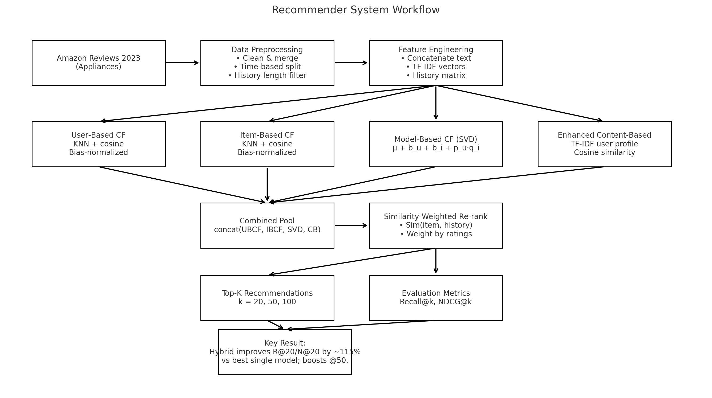
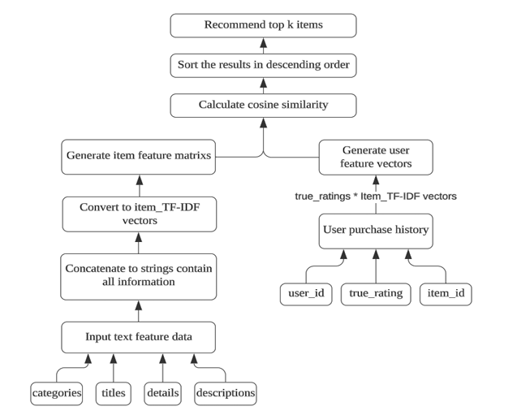
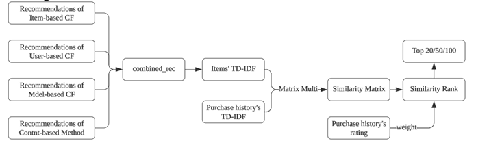

# **Forecasting of Customer’s Purchasing**

  

## **Overview**

  

This project investigates multiple recommender system algorithms to improve personalized product recommendations for e-commerce. Using the Amazon Appliances dataset, we evaluate four single-model approaches—User-Based Collaborative Filtering, Item-Based Collaborative Filtering, Model-Based Collaborative Filtering (SVD), and an enhanced Content-Based Method—before proposing a novel hybrid method that combines their outputs using a similarity-based weighted integration strategy.

  

Our hybrid model achieves **up to 115% improvement** in Recall@20 and NDCG@20 compared to the best-performing single model, effectively mitigating issues of **data sparsity** and **unbalanced user ratings**.


## **Dataset**

  

We used the [Amazon Reviews 2023](https://amazon-reviews-2023.github.io/) dataset focusing on the Appliances category.

  

**Raw Data:**

- **Review Table:** 2.12M entries, 8 features (user ID, product ID, rating, text review, timestamp, etc.)
    
- **Product Meta Table:** 94k entries, 14 features (title, categories, description, features, images, etc.)
    

  

**Processed Data:**

- Users filtered to history length between 23–75
    
- TF-IDF encoding on combined textual features (categories, title, description, details)
    
- Final sparsity: **99.98%**
    


## **Workflow**
 

## **Methods**

  

### **1. User-Based Collaborative Filtering (UBCF)**

- Finds k-nearest users using cosine similarity
    
- Adjusts for rating scale bias
    
- Predicts ratings from neighbors’ weighted deviations
    

  

### **2. Item-Based Collaborative Filtering (IBCF)**

- Finds k-nearest items using cosine similarity
    
- Adjusts for item rating bias
    
- Predicts ratings based on user’s ratings for similar items
    

  

### **3. Model-Based Collaborative Filtering (SVD)**

- Matrix factorization with user/item latent factors
    
- Incorporates user bias, item bias, and global mean
    

  

### **4. Enhanced Content-Based Method**

- TF-IDF representation of product text features
    
- User preference vector computed from rated item vectors
    
- Cosine similarity for recommendation ranking
 
    

  

### **5. Novel Hybrid Method**

- Combines recommendations from all four models
    
- Re-ranks combined list using similarity-weighted scores based on user history
    
- Selects top-k items for final recommendation
 
    


## **Evaluation Metrics**

  

We evaluate recommendations using:

- **Recall@k**: Ability to retrieve all relevant items
    
- **NDCG@k**: Ranking quality of recommended items
    

  

Metrics calculated for **k = 20, 50, 100**.


## **Results**

|**Model**|**R@20**|**N@20**|**R@50**|**N@50**|**R@100**|**N@100**|
|---|---|---|---|---|---|---|
|User-CF|0.30|0.29|0.93|0.89|2.13|2.05|
|Item-CF|0.07|0.06|0.12|0.12|0.35|0.34|
|SVD (Model-CF)|0.26|0.25|1.13|1.10|2.27|2.23|
|Content-Based|2.05|2.00|5.68|5.58|9.93|9.78|
|**Hybrid**|**4.40**|**4.33**|**7.51**|**7.37**|**9.95**|**9.79**|

**Key Takeaways:**

- Content-based outperforms all single collaborative models in sparse data
    
- Hybrid approach significantly boosts short-list recommendation accuracy
    


## Project Structure

.
├── Code/                 # Notebooks / scripts for methods, training, evaluation
├── Data/                 # Dataset files and any processed/intermediate data
├── forcast_pic.png       # Figure for enhanced content-based method
├── hybird.png            # Figure for hybrid method
├── workflow.png          # Project workflow diagram
└── README.md             # Project documentation


## **Requirements**

- Python 3.9+
    
- numpy
    
- pandas
    
- scikit-learn
    
- scipy
    

  

Install dependencies:

```
pip install -r requirements.txt
```


## **Usage**

1. **Preprocess Data**
    

```
python src/preprocessing.py
```

2. **Train and Evaluate Models**
    

```
python src/user_cf.py
python src/item_cf.py
python src/model_cf.py
python src/content_based.py
python src/hybrid.py
```

3. **View Results**
    
    Evaluation metrics and plots will be saved in /results.
    


## **References**

1. [Amazon Reviews 2023](https://amazon-reviews-2023.github.io/)
    
2. Herlocker, J.L., et al., _An algorithmic framework for performing collaborative filtering_, SIGIR 1999.
    
3. Sarwar, B., et al., _Item-based collaborative filtering recommendation algorithms_, WWW 2001.
    
4. Koren, Y., et al., _Matrix Factorization Techniques for Recommender Systems_, IEEE Computer 2009.
    
5. Chulyadyo, R., Leray, P., _A Personalized Recommender System from Probabilistic Relational Model and Users’ Preferences_, Procedia Computer Science 2014.
    


